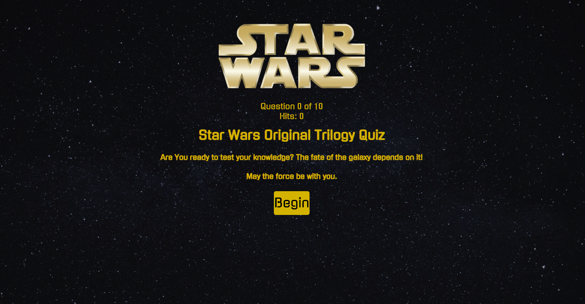

# Star Wars Quiz App

Scout the Station here! https://ort-cloud.github.io/The-ISS-Scout/

## Summary

A simple web app testing the users knowledge of the first three Star Wars Films. The app uses a combination of HTML5, CSS3, and JavaScript with the assistance of the jQuery library. The user is taken through a series of 10 questions. With each selection the user is then given feedback informing them if they got the answer correct, if not they are given the correct answer. The users score is calculated throughout and will lead them to one of three responses depending upon the accumulated score.

## Implemented Technologies

To build our application, we've used the following web programming languages:

- jQUery
- JavaScript
- HTML5
- CSS3

## Created by

**Carl Ortutay**
